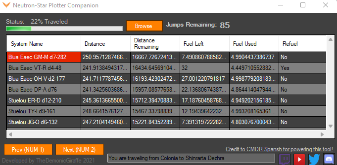

# Neutron-Star-Plotter-Companion
A tiny compact program that uses Num1 &amp; Num2 (even when not focused) to automatically select and copy the next system on your route. it also keeps track of how many jumps are left on your trip!

